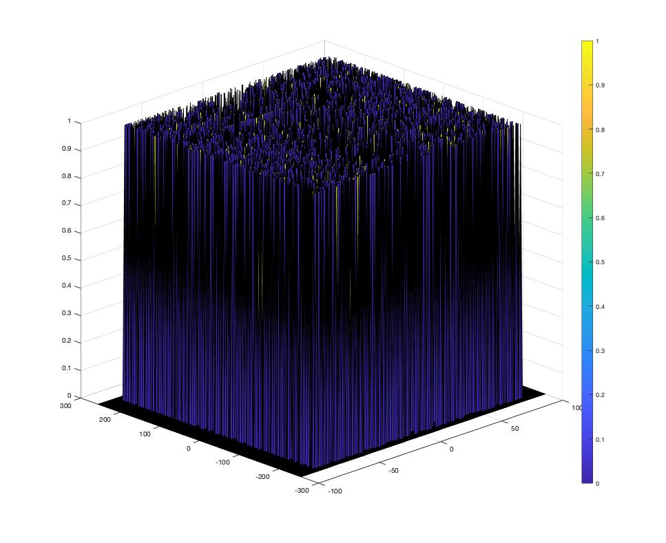
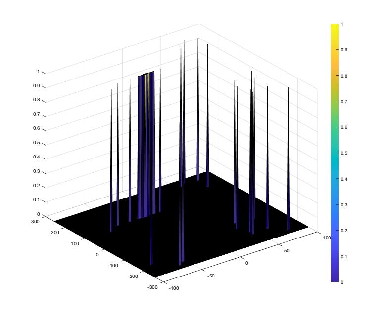
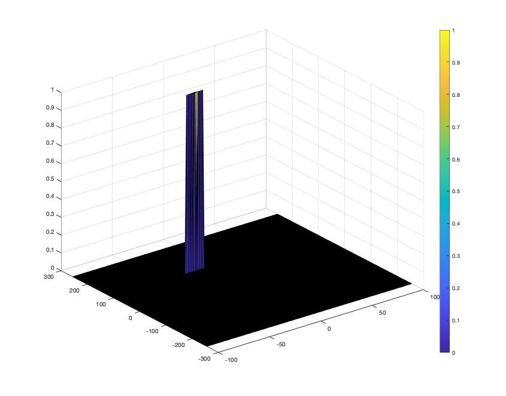

# SFND_RADAR_Target_Generation_and_Detection

## 2D CFAR
The following steps were taken for the implementation for 2D CFAR:
1. The number of Training and Guard Band columns and rows.
2. A sliding window of the follwoing format is created such that the Training cells have value 1 while rest of the cells have value 0.
<pre>

             T T T T T T T T T T T  

             T T T T T T T T T T T  

             T T T G G G G G T T T  

             T T T G G C G G T T T  

             T T T G G G G G T T T  

             T T T T T T T T T T T  

             T T T T T T T T T T T  

  

             1 1 1 1 1 1 1 1 1 1 1  

             1 1 1 1 1 1 1 1 1 1 1  

             1 1 1 0 0 0 0 0 1 1 1  

             1 1 1 0 0 0 0 0 1 1 1  

             1 1 1 0 0 0 0 0 1 1 1  

             1 1 1 1 1 1 1 1 1 1 1  

             1 1 1 1 1 1 1 1 1 1 1  

</pre>

  

3. An output matrix consisting of zeros is created with size same as fft2 RDM matrix.
4. A loop is created to pass the sliding window over the fft2 RDM matrix.
5. Threshold is created by summing all the noise cell values and taking mean.
6. Thresholds is multiplied by an offset to maintain the SNR.
7. Output matrix cell are given the value of 1 if signal is greater than threshold else it reamins 0.

### Offset Selection
I started with a low value of 1.5. That resulted in a lot fo noise being selected as target.

 

I increased the offset to 2.5. There was still a few noise peaks selected as targets.

 

Finally the value of 4.0 was settled. Since it was the minimum offset value to give a defined target without any noise being selected.

 